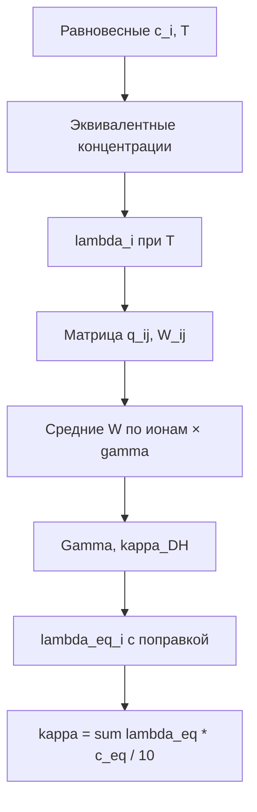

# Удельная электропроводность

Порт VBA `el_conduct` (метод Ларина–Лукомской). Реализация: [ion_model/conductivity.py](../ion_model/conductivity.py).

## 11. Удельная электропроводность (`el_conduct`)

После расчёта равновесного состава Excel вызывает `el_conduct(c_a, c_c, T_c)` и записывает результат в **K13** (См/м). В ячейке **B24** тот же результат показан как κ в **мСм/см** (×10).

Реализация в Python: `el_conduct()`, `equilibrium_conductivity()`.

Метод основан на работе **Ларина и Лукомской** (метод массовых / эквивалентных долей ионов в многокомпонентном растворе). В диссертации указана погрешность **не более ~7%** при ионной силе до **0,05 экв/л**.

### 11.1. Входные данные

Два массива концентраций в **моль/л** (не эквивалентных):

**Катионы** `c_c` (4 компонента):

| Индекс | Ион | λ°(25 °C), См·см²/экв |
|--------|-----|------------------------|
| 1 | Na⁺ | 50.1 |
| 2 | Ca²⁺ | 59.5 |
| 3 | Mg²⁺ | 53.06 |
| 4 | H⁺ | 349.7 |

**Анионы** `c_a` (6 компонентов):

| Индекс | Ион | λ°(25 °C) |
|--------|-----|-----------|
| 1 | Cl⁻ | 76.3 |
| 2 | NO₃⁻ | 71.4 |
| 3 | SO₄²⁻ | 50.0 |
| 4 | HCO₃⁻ | 44.5 |
| 5 | CO₃²⁻ | 69.3 |
| 6 | OH⁻ | 197.6 |

Соответствие столбцам листа *Ion Equlibrium* (строка 11) и вектору из 11 компонентов:

| `c_c` | Столбец | `c_a` | Столбец |
|-------|---------|-------|---------|
| Na⁺ | B | Cl⁻ | E |
| Ca²⁺ | C | NO₃⁻ | F |
| Mg²⁺ | D | SO₄²⁻ | G |
| H⁺ | L | HCO₃⁻ | I |
| | | CO₃²⁻ | J |
| | | OH⁻ | K |

> **Замечание.** В VBA `CommandButton1` для 4-го катиона ошибочно берётся ячейка **K11** (OH⁻) вместо **L11** (H⁺). Для побитового совпадения с Excel в Python используйте `equilibrium_conductivity(..., excel_vba_mapping=True)`. Физически корректнее `excel_vba_mapping=False` (разница ~0,01% для типичного примера).

### 11.2. Эквивалентные концентрации

Для каждого иона:

$$
\tilde{c}_i = |z_i|\, c_i \quad\text{(моль-экв/л)}
$$

### 11.3. Температурная поправка λ°

$$
\lambda_i(T) = \lambda_i^{25}\,\bigl(1 + \alpha_i\,(T_\mathrm{K} - 298)\bigr)
$$

Температурные коэффициенты $\alpha_i$ (1/К) заданы в коде для каждого иона (см. `ion_model/conductivity.py`).

Также используются:

- диэлектрическая проницаемость воды $\varepsilon(T)$ — та же формула, что в `el_conduct`;
- вязкость $\eta(T) = 2.414\times10^{-5}\,10^{247.8/(T_\mathrm{K}-140)}$ Па·с.

### 11.4. Поправочный множитель q для пар «катион–анион»

Для каждой пары $(i,j)$:

$$
q_{ij} = \frac{|z_i z_j|}{|z_i|+|z_j|} \cdot \frac{\lambda_i + \lambda_j}{|z_i|\lambda_i + |z_j|\lambda_j}
$$

### 11.5. Множитель W (массовая доля в паре)

$$
W_{ij} = \frac{|z_i z_j|\, q_{ij}}{1 + \sqrt{q_{ij}}}
$$

### 11.6. Усреднение W по иону и эмпирические γ

Для каждого катиона $i$ — взвешенное среднее $W_{ij}$ по эквивалентным концентрациям анионов, умножение на эмпирический коэффициент $\gamma_i$:

| Ион | γ |
|-----|---|
| Na⁺ | 1.0 |
| Ca²⁺ | 2.5 |
| Mg²⁺ | 2.0 |
| H⁺ | 1.4 |
| Cl⁻ | 1.0 |
| NO₃⁻ | −0.5 |
| SO₄²⁻ | 1.0 |
| HCO₃⁻ | 1.0 |
| CO₃²⁻ | 2.0 |
| OH⁻ | 1.6 |

Аналогично для анионов — среднее по катионам. Получаются $\bar{W}_i^{+}$, $\bar{W}_j^{-}$.

### 11.7. Параметр ионной силы для поправки Кохрауша

$$
\Gamma = \sqrt{\sum_i \tilde{c}_i\,|z_i|}
$$

(в коде `sum1` после возведения эквивалентных сумм в степень 0.5).

Вспомогательный параметр:

$$
\kappa_\mathrm{DH} = \frac{5.029\times10^{9}\,\Gamma}{\sqrt{2}\,\sqrt{\varepsilon\, T_\mathrm{K}}} \times 100
$$

### 11.8. Эквивалентная электропроводность иона с поправкой на концентрацию

Для каждого иона (катиона и аниона):

$$
\alpha_i = \frac{1.97\times10^{6}\,\bar{W}_i}{(\varepsilon\, T_\mathrm{K})^{3/2}}
\qquad
\beta_i = \frac{28.98\,|z_i|}{10\,\eta\,\sqrt{\varepsilon\, T_\mathrm{K}}}
$$

$$
\lambda_{\mathrm{eq},i} = \lambda_i(T) - (\alpha_i\,\lambda_i(T) + \beta_i)\,\frac{\Gamma}{1 + \kappa_\mathrm{DH}\, r_i}
$$

где $r_i$ — эффективный радиус иона (м), табличная константа в коде.

### 11.9. Удельная электропроводность раствора

$$
\kappa = \frac{1}{10}\sum_i \lambda_{\mathrm{eq},i}\,\tilde{c}_i \quad\text{(См/м)}
$$

Суммирование идёт по всем катионам и анионам. Деление на 10 переводит из внутренних единиц VBA в **См/м**.

Перевод единиц:

| Единица | Связь |
|---------|--------|
| См/м | результат `el_conduct` |
| мСм/см | κ × 10 (ячейка B24) |
| мкСм/см | κ × 10⁴ |

### 11.10. Алгоритм (блок-схема)



### 11.11. Пример (лист Excel, t = 18 °C)

После стандартного теста равновесия:

| Величина | Python | Excel |
|----------|--------|-------|
| κ | 0.063526 См/м | K13 = 0.063526 |
| κ | 0.635 мСм/см | B24 = 0.635 |

```python
from ion_model import equilibrium_calc, equilibrium_conductivity

result = equilibrium_calc(1.0, 18.0, moles_added=n, initial_concentrations=c0)
kappa = equilibrium_conductivity(
    result.concentrations, 18.0, excel_vba_mapping=True
)
```
