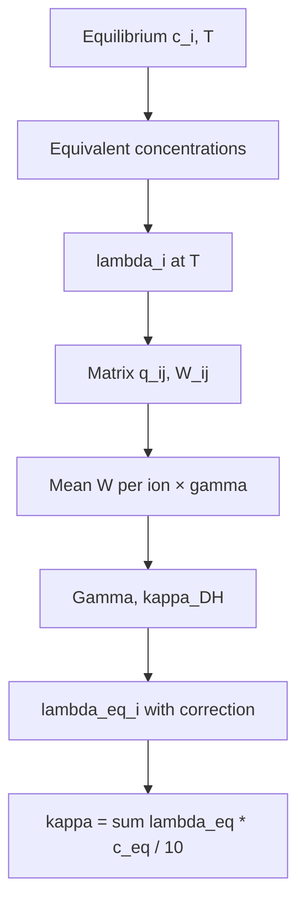

# Specific conductivity

Port of VBA `el_conduct` (Larin–Lukomskaya method). Implementation: [ion_model/conductivity.py](../../ion_model/conductivity.py).

## Specific conductivity (`el_conduct`)

After computing the equilibrium composition, Excel calls `el_conduct(c_a, c_c, T_c)` and writes the result to **K13** (S/m). Cell **B24** shows the same κ in **mS/cm** (×10).

Python: `el_conduct()`, `equilibrium_conductivity()`.

The method is based on **Larin and Lukomskaya** (mass / equivalent fractions of ions in a multicomponent solution). The dissertation quotes error **≤ ~7%** at ionic strength up to **0.05 eq/L**.

### Input data

Two concentration arrays in **mol/L** (not equivalent):

**Cations** `c_c` (4 components):

| Index | Ion | λ°(25 °C), S·cm²/eq |
|-------|-----|---------------------|
| 1 | Na⁺ | 50.1 |
| 2 | Ca²⁺ | 59.5 |
| 3 | Mg²⁺ | 53.06 |
| 4 | H⁺ | 349.7 |

**Anions** `c_a` (6 components):

| Index | Ion | λ°(25 °C) |
|-------|-----|-----------|
| 1 | Cl⁻ | 76.3 |
| 2 | NO₃⁻ | 71.4 |
| 3 | SO₄²⁻ | 50.0 |
| 4 | HCO₃⁻ | 44.5 |
| 5 | CO₃²⁻ | 69.3 |
| 6 | OH⁻ | 197.6 |

Mapping to *Ion Equlibrium* sheet (row 11) and the 11-component vector:

| `c_c` | Column | `c_a` | Column |
|-------|--------|-------|--------|
| Na⁺ | B | Cl⁻ | E |
| Ca²⁺ | C | NO₃⁻ | F |
| Mg²⁺ | D | SO₄²⁻ | G |
| H⁺ | L | HCO₃⁻ | I |
| | | CO₃²⁻ | J |
| | | OH⁻ | K |

> **Note.** In VBA `CommandButton1`, the 4th cation slot incorrectly reads **K11** (OH⁻) instead of **L11** (H⁺). For bit-exact Excel match use `equilibrium_conductivity(..., excel_vba_mapping=True)`. Physically, `excel_vba_mapping=False` is preferable (~0.01% difference for the standard example).

### Equivalent concentrations

For each ion:

$$
\tilde{c}_i = |z_i|\, c_i \quad\text{(mol-eq/L)}
$$

### Temperature correction of λ°

$$
\lambda_i(T) = \lambda_i^{25}\,\bigl(1 + \alpha_i\,(T_\mathrm{K} - 298)\bigr)
$$

Temperature coefficients $\alpha_i$ (1/K) are tabulated in `ion_model/conductivity.py`.

Also used:

- water dielectric permittivity $\varepsilon(T)$ — same formula as in `el_conduct`;
- viscosity $\eta(T) = 2.414\times10^{-5}\,10^{247.8/(T_\mathrm{K}-140)}$ Pa·s.

### Pair correction factor q

For each cation–anion pair $(i,j)$:

$$
q_{ij} = \frac{|z_i z_j|}{|z_i|+|z_j|} \cdot \frac{\lambda_i + \lambda_j}{|z_i|\lambda_i + |z_j|\lambda_j}
$$

### Factor W (mass fraction in pair)

$$
W_{ij} = \frac{|z_i z_j|\, q_{ij}}{1 + \sqrt{q_{ij}}}
$$

### Averaging W per ion and empirical γ

For each cation *i* — weighted mean of $W_{ij}$ over anion equivalent concentrations, times empirical $\gamma_i$:

| Ion | γ |
|-----|---|
| Na⁺ | 1.0 |
| Ca²⁺ | 2.5 |
| Mg²⁺ | 2.0 |
| H⁺ | 1.4 |
| Cl⁻ | 1.0 |
| NO₃⁻ | −0.5 |
| SO₄²⁻ | 1.0 |
| HCO₃⁻ | 1.0 |
| CO₃²⁻ | 2.0 |
| OH⁻ | 1.6 |

Similarly for anions. This yields $\bar{W}_i^{+}$, $\bar{W}_j^{-}$.

### Ionic strength parameter for Kohlrausch correction

$$
\Gamma = \sqrt{\sum_i \tilde{c}_i\,|z_i|}
$$

Auxiliary parameter:

$$
\kappa_\mathrm{DH} = \frac{5.029\times10^{9}\,\Gamma}{\sqrt{2}\,\sqrt{\varepsilon\, T_\mathrm{K}}} \times 100
$$

### Equivalent conductivity with concentration correction

For each ion:

$$
\alpha_i = \frac{1.97\times10^{6}\,\bar{W}_i}{(\varepsilon\, T_\mathrm{K})^{3/2}}
\qquad
\beta_i = \frac{28.98\,|z_i|}{10\,\eta\,\sqrt{\varepsilon\, T_\mathrm{K}}}
$$

$$
\lambda_{\mathrm{eq},i} = \lambda_i(T) - (\alpha_i\,\lambda_i(T) + \beta_i)\,\frac{\Gamma}{1 + \kappa_\mathrm{DH}\, r_i}
$$

where $r_i$ is the effective ion radius (m), a tabulated constant in code.

### Specific conductivity of the solution

$$
\kappa = \frac{1}{10}\sum_i \lambda_{\mathrm{eq},i}\,\tilde{c}_i \quad\text{(S/m)}
$$

Summation over all cations and anions. Division by 10 converts VBA internal units to **S/m**.

Unit conversion:

| Unit | Relation |
|------|----------|
| S/m | `el_conduct` output |
| mS/cm | κ × 10 (cell B24) |
| µS/cm | κ × 10⁴ |

### Algorithm (flowchart)



### Example (Excel sheet, t = 18 °C)

After the standard equilibrium test:

| Quantity | Python | Excel |
|----------|--------|-------|
| κ | 0.063526 S/m | K13 = 0.063526 |
| κ | 0.635 mS/cm | B24 = 0.635 |

```python
from ion_model import equilibrium_calc, equilibrium_conductivity

result = equilibrium_calc(1.0, 18.0, moles_added=n, initial_concentrations=c0)
kappa = equilibrium_conductivity(
    result.concentrations, 18.0, excel_vba_mapping=True
)
```
